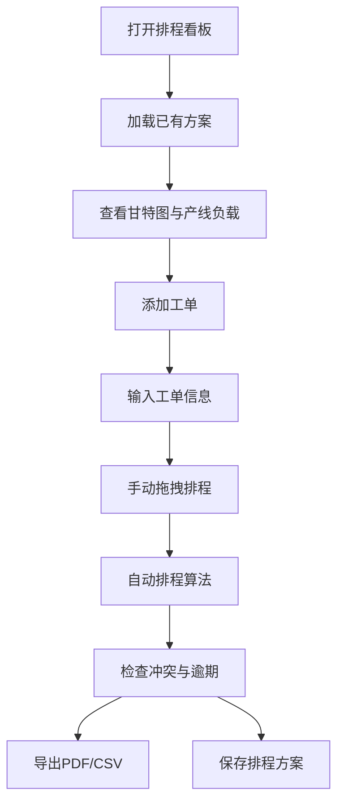

## 1. 产品概述
车间生产工单排程看板是一款面向工厂计划员的可视化排程工具，通过拖拽式甘特图界面实现三条产线（A线、B线、C线）的工单管理与调度。

- 目标用户：工厂生产计划员
- 核心价值：直观高效的工单调度、自动排程算法、产线负载可视化、多方案管理

## 2. 核心功能

### 2.1 用户角色
| 角色 | 注册方式 | 核心权限 |
|------|----------|----------|
| 计划员 | 无需注册 | 完整的工单管理、排程、导出功能 |

### 2.2 功能模块
1. **工单管理**：添加新工单、查看工单列表、删除工单
2. **甘特图看板**：拖拽式排程界面，三条产线时间轴展示
3. **自动排程**：最早交货日期优先、最短工时优先两种算法
4. **产线负载监控**：负载率彩色进度条、逾期工单统计
5. **导出功能**：支持导出为PDF和CSV格式
6. **方案管理**：保存/加载多个排程方案到localStorage

### 2.3 页面详情
| 页面名称 | 模块名称 | 功能描述 |
|----------|----------|----------|
| 主页面 | 顶部工具栏 | 添加工单按钮、自动排程按钮、导出按钮、方案管理下拉菜单 |
| 主页面 | 统计面板 | 总工单数量、逾期工单数量、各产线负载率 |
| 主页面 | 甘特图区域 | 三条产线时间轴、可拖拽工单块、时间刻度标尺 |
| 主页面 | 工单列表 | 待排程工单列表，支持拖拽到产线 |
| 主页面 | 工单详情弹窗 | 添加工单表单，包含产品型号、数量、标准工时、交货日期 |

## 3. 核心流程

计划员登录看板 → 查看当前排程状态 → 添加工单/调整工单 → 手动拖拽或自动排程 → 检查产线负载与逾期情况 → 导出排程表/保存方案

## 4. 用户界面设计

### 4.1 设计风格
- **主色调**：深灰蓝背景（#1a1f2e），工业风格
- **强调色**：
  - A线：青色（#00d4ff）
  - B线：橙色（#ff9500）
  - C线：绿色（#34c759）
  - 逾期告警：红色（#ff3b30）
- **字体**：JetBrains Mono（等宽，工业感）+ Noto Sans SC（中文）
- **布局**：网格布局，功能分区明确，深色模式
- **交互**：拖拽阴影反馈、悬停高亮、平滑过渡动画

### 4.2 页面设计概览
| 页面名称 | 模块名称 | UI元素 |
|----------|----------|--------|
| 主页面 | 顶部工具栏 | 品牌标识、功能按钮组、方案选择下拉 |
| 主页面 | 统计卡片 | 三个统计卡片（总工单、逾期数、平均负载率）带图标和数值 |
| 主页面 | 甘特图 | 左侧产线标签、顶部时间标尺、可拖拽工单条、网格背景 |
| 主页面 | 侧边栏 | 待排程工单列表、产线负载进度条 |
| 主页面 | 弹窗 | 居中模态框、表单输入、确认/取消按钮 |

### 4.3 响应式
- 桌面端优先设计
- 甘特图区域支持横向滚动
- 侧边栏可折叠

### 4.4 动效设计
- 页面加载时元素渐入（staggered reveal）
- 工单拖拽时阴影加深、缩放微放大
- 按钮悬停时背景色渐变
- 进度条数值变化时平滑过渡
- 弹窗出现时缩放+淡入
