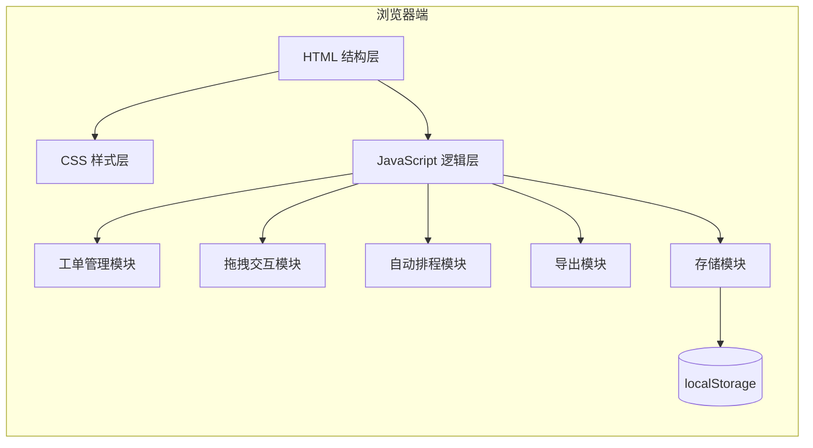

## 1. 架构设计

纯前端单页应用，无后端依赖，数据持久化通过浏览器localStorage实现。



## 2. 技术描述

- **前端**：原生 HTML5 + CSS3 + Vanilla JavaScript (ES6+)
- **导出PDF**：使用浏览器原生打印API配合打印样式
- **导出CSV**：纯JavaScript生成CSV文件并触发下载
- **数据存储**：浏览器 localStorage
- **图标**：内联SVG图标，无需外部依赖
- **字体**：Google Fonts CDN (JetBrains Mono + Noto Sans SC)

## 3. 文件结构

```
d:\code\TraeProjects\1411\
├── index.html          # 主页面
├── css/
│   └── style.css       # 主样式文件
├── js/
│   ├── app.js          # 主应用入口
│   ├── store.js        # 数据存储与状态管理
│   ├── gantt.js        # 甘特图渲染与拖拽
│   ├── scheduler.js    # 自动排程算法
│   ├── export.js       # 导出功能
│   └── utils.js        # 工具函数
└── .trae/
    └── documents/
        ├── PRD-车间生产工单排程看板.md
        └── 技术架构-车间生产工单排程看板.md
```

## 4. 数据模型

### 4.1 工单 (WorkOrder)
```javascript
{
  id: string,           // 唯一标识（UUID）
  productModel: string, // 产品型号
  quantity: number,     // 数量
  stdMinutes: number,   // 标准工时（分钟）
  dueDate: string,      // 交货日期 (YYYY-MM-DD)
  lineId: string|null,  // 分配的产线ID ('lineA'|'lineB'|'lineC'|null)
  startMinute: number,  // 开始时间（分钟数，从当日0点算起）
  createdAt: number     // 创建时间戳
}
```

### 4.2 排程方案 (Schedule)
```javascript
{
  id: string,           // 方案ID
  name: string,         // 方案名称
  workOrders: WorkOrder[],
  createdAt: number,
  updatedAt: number
}
```

### 4.3 产线定义
```javascript
{
  id: 'lineA' | 'lineB' | 'lineC',
  name: 'A线' | 'B线' | 'C线',
  color: string,
  workStartTime: 480,   // 上班时间 08:00 = 480分钟
  workEndTime: 1080     // 下班时间 18:00 = 1080分钟
}
```

## 5. 核心模块设计

### 5.1 存储模块 (store.js)
- 初始化默认数据
- CRUD操作工单
- 方案的保存/加载/删除
- localStorage读写封装

### 5.2 甘特图模块 (gantt.js)
- 渲染时间轴与产线
- 渲染工单条块
- 拖拽逻辑（横向调整时间、纵向切换产线）
- 冲突检测
- 碰撞吸附

### 5.3 排程模块 (scheduler.js)
- 最早交货日期优先算法 (EDD)
- 最短工时优先算法 (SPT)
- 产线负载均衡分配

### 5.4 导出模块 (export.js)
- CSV导出：生成纯文本CSV，Blob触发下载
- PDF导出：使用 window.print() 配合专用打印样式

### 5.5 工具函数 (utils.js)
- 时间格式化
- UUID生成
- 日期计算
- 冲突检测算法

## 6. 关键算法

### 6.1 冲突检测
- 同产线工单时间区间重叠判断
- 拖拽时实时检测，冲突则工单变红
- 放下时若冲突，自动回退到原位置

### 6.2 自动排程 (EDD算法)
1. 按交货日期升序排序所有待排程工单
2. 遍历每条产线，找到当前最早空闲的产线
3. 将工单分配到该产线的最早可用时间段
4. 考虑工作时间限制（8:00-18:00）

### 6.3 负载率计算
- 负载率 = 产线已安排总工时 / 产线日工作时长
- 按日期范围计算（默认显示未来7天）
- 颜色分级：<70%绿色、70%-90%黄色、>90%红色
